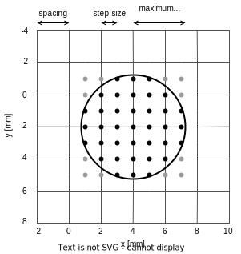
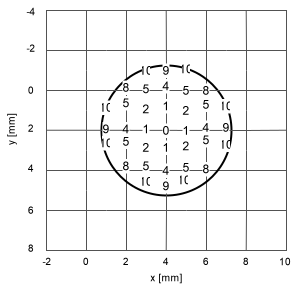

Algorithms
==========

YAGIT implements two methods to calculate the gamma index. Wendling method is much faster than Classic method.

Classic method
--------------

Classic method was introduced with the paper that introduced gamma index concept by Low et al. [1]_ in 1998.
This is a brute-force method, and because of that, it is very slow. It is based on calculating
gamma function for each pair of points in reference image and evaluated image. This results in a time complexity of
:math:`O(n^k * n^k) = O(n^{2k})`, where :math:`n` is the size of each axis of the input data and :math:`k` is the
dimensionality of the data. For example 3D gamma index has :math:`O(n^6)` time complexity.

The subsequent steps of the algorithm are as follows:

.. rst-class:: list

#. For each reference point :math:`\vec{r_r}` calculate gamma index :math:`\gamma(\vec{r_r})`:

    A. For each evaluated point :math:`\vec{r_e}` calculate gamma function :math:`\Gamma(\vec{r_r}, \vec{r_e})`.
    B. Choose the minimum value of calculated :math:`\Gamma(\vec{r_r}, \vec{r_e})`
       as the gamma index :math:`\gamma(\vec{r_r})`.

#. In the end, the gamma index image is obtained.

To speed up these calculations for 3D images, a 2.5D method was introduced, which involves calculating the gamma index
in 2D version for each slice of the 3D image separately. This results in a time complexity of
:math:`O(n^3 * n^2) = O(n^5)`. Unfortunately, it returns less accurate results.

A commonly used step in classic method to obtain more accurate results is the interpolation of evaluated image
before initiating gamma index calculations. This results in larger input data, further increasing the computation time.
Low and Dempsey propose that spacing in the evaluated image should be less than or equal to :math:`\frac{1}{3}`
of the DTA acceptance criterion [2]_.

Wendling method
---------------

In 2007, a new fast method was introduced by Wendling et al. [3]_.
It is based on limiting the searched area in the evaluated image to a circle (in the case of 2D and 2.5D version)
or a sphere (in the case of 3D version).
There is a higher probability of finding the minimum value of the gamma function in the vicinity of the reference point
than in some distant place.

   Limited area (circle) on a 2D evaluated image. Gamma function is calculated only for black points.
   Values at those points are interpolated on-the-fly.

Such a limited area has a maximum search radius and step size, which are parameters of this method.
Evaluated points, which are checked, are located on a grid with intervals equal to the step size,
and their distance from the center does not exceed the search radius.
Wendling et al. propose that the step size should be around :math:`\frac{1}{10}` of the DTA acceptance criterion
for precise results.
The values at points that do not exist in the evaluated image are determined on-the-fly using interpolation
(e.g. bilinear for 2D and trilinear for 3D).

Some optimizations of on-the-fly interpolation can be achieved by resampling the evaluated image onto the grid
of the reference image before initiating gamma index calculations.
However, YAGIT doesn't perform this step due to two reasons that can lead to less accurate results.
Firstly, this approach involves double interpolation -- first during the resampling process
and second during on-the-fly interpolation.
Second interpolation uses interpolated points from first interpolation, which can result in less accurate calculations.
Another reason is the fact that the evaluated image we start with can have a denser grid than the reference image,
and by resampling it, we would lose a lot of information.

   Squared distances from the center in limited area (circle) on a 2D evaluated image.

An important part of this method is the order of the traversing through points in the limited area.
We start from the point at the center of the circle/sphere and traverse through subsequent points that are
increasingly distant from the center.
This order and the squared distances only need to be calculated once -- at the very beginning --
and then used thereafter.

Significant speedup can be achieved by stopping the search when it is no longer possible for subsequent points
to yield a smaller value of the gamma function, which occurs when :math:`\frac{r(\vec{r_r}, \vec{r_e})}{\Delta d}`
is greater than or equal to the current minimum value of the gamma function :math:`\Gamma` for :math:`\vec{r_r}`.

The subsequent steps of the algorithm are as follows:

.. rst-class:: list

#. Resample the evaluated image onto the grid of the reference image (YAGIT doesn't do this).
#. Create a list of points located within the circle/sphere, sorted in ascending order by their distance from the center
   of the circle/sphere.
#. For each reference point :math:`\vec{r_r}` calculate gamma index :math:`\gamma(\vec{r_r})` searching within
   the limited region on the evaluated image:

   A. Start searching in :math:`\vec{r_e} = \vec{r_r}` and move through the previously created list of points,
      which are increasingly further from the initial point:

      a. If the value :math:`r(\vec{r_r}, \vec{r_e}) / \Delta d` is greater than or equal to the current minimum
         found value of the gamma function :math:`\Gamma` for :math:`\vec{r_r}`, then stop the search.
      b. Determine the value at the point :math:`\vec{r_e}` using interpolation.
      c. Calculate the value of the gamma function :math:`\Gamma(\vec{r_r}, \vec{r_e})`.

   B. Choose the minimum value of calculated :math:`\Gamma(\vec{r_r}, \vec{r_e})`
      as the gamma index :math:`\gamma(\vec{r_r})`.

#. In the end, the gamma index image is obtained.

The time complexity of such an algorithm is :math:`O(n^k * m^k)`,
where :math:`n` is the number of voxels along each axis,
:math:`k` is the dimensionality of the data
and :math:`m`` is the number of points along the radius of the circle/sphere.
Typically, the algorithm only traverses through a small portion of points within the circle/sphere,
so the average complexity is better.

References
----------

.. [1] D. A. Low, W. B. Harms, S. Mutic, and J. A. Purdy,
       “A technique for the quantitative evaluation of dose distributions,”
       Medical Physics, vol. 25, no. 5, pp. 656-661, 1998.

.. [2] D. A. Low and J. F. Dempsey,
       “Evaluation of the gamma dose distribution comparison method,”
       Medical Physics, vol. 30, no. 9, pp. 2455-2464, 2003.

.. [3] M. Wendling, L. Zijp, L. McDermott, E. Smit, J.-J. Sonke, B. Mijnheer, and M. Herk,
       “A fast algorithm for gamma evaluation in 3d,”
       Medical physics, vol. 34, pp. 1647-54, 06 2007.
