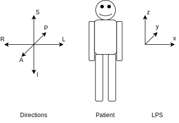
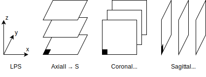
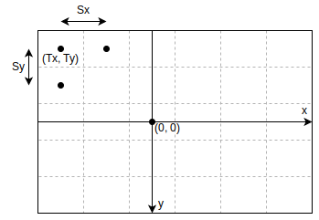
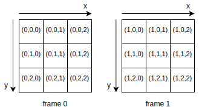
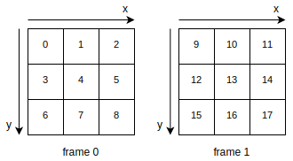

Data representation
===================

Coordinate system
-----------------

DICOM and MetaImage use patient (anatomical) coordinate system that is relative to the patient.
If patient orientation on the couch is changed, then the patient coordinate system is rotated accordingly.
Other coordinate systems used in radiotherapy are the couch (fixed, room) coordinate system
and the beam (gantry) coordinate system.

   Directions and LPS coordinate system relative to a patient.
   
   L -- Left, R -- Right, A -- Anterior, P -- Posterior, S -- Superior, I -- Inferior.

Specifically, DICOM uses LPS (right to Left, anterior to Posterior, inferior to Superior) coordinate system.
MetaImage uses the same system, but it denotes it as RAI (Right to left, Anterior to posterior, Inferior to superior).
YAGIT also uses this system.

The three-letter coordinate system defines the axis directions as well as their order.
The first letter corresponds to the x-axis, the second to the y-axis, and the third to the z-axis.
For example, in the LPS system: L=x, P=y, S=z, and in the SLP system: S=x, L=y, P=z.

Image planes
------------

The 3D image can be viewed from three perspectives: axial, coronal and sagittal.
Axial (also known as transverse or horizontal) separates the superior from the inferior.
Coronal (also known as frontal) separates the anterior from the posterior.
Sagittal (also known as longitudinal) separates the left from the right.

   3D image planes -- axial, coronal and sagittal -- with coordinates consistent with LPS.
   The black filled squares represent the first voxel of an image.

The ith column, jth row, kth frame map to the coordinates xyz for the respective planes as follows:

.. rst-class:: list list-math-right

- Axial: :math:`ijk \rightarrow xyz`
- Coronal: :math:`ijk \rightarrow xzy`
- Sagittal: :math:`ijk \rightarrow yzx`

A 3D image is stored in a file slice-by-slice using one out of three planes.
The plane used depends on the third letter of the coordinate system:
S or I for axial, A or P for coronal, L or R for sagittal.
In the LPS coordinate system, slices are stored using the axial plane.

Note that when calculating the gamma index, YAGIT does not take into account whether the plane of the image was changed
after reading from a file.
It treats all images as if they were stored in the axial plane.

Image position and voxel spacing
--------------------------------

Image position refers to the coordinates x, y, z of the first voxel of the image, expressed in millimeters.
It determines the offset from the point (0, 0, 0), which is related to the treatment machine,
and it is the intersection point of the x, y, and z axes.

Voxel spacing specifies the distances between adjacent voxels along each axis in millimeters.
Alternatively, it can be viewed as the size of a voxel.
The voxel spacing can have different values for each axis,
but if all three spacings are equal, the image is said to have isotropic voxel spacing.

Additionally, DICOM allows for unevenly distributed spacing along the z-axis (spacing between slices),
as the spacing may be greater in areas that are farther from the main region of interest.
YAGIT doesn't support this kind of images.

   Example of image position and pixel spacing for a 2D image.

   :math:`T_x, T_y` -- image position, :math:`S_x, S_y` -- pixel spacing.

Image orientation
-----------------

The image orientation indicates how the patient is positioned on the couch --
whether lying on their back, stomach, or side,
and whether they are oriented head-first or feet-first towards the machine.
The most basic orientation is HFS (Head First Supine).
In this case, the patient is positioned head-first towards the machine and lying on their back.

The image orientation is provided in the form of direction cosines of the first row and the first column,
as well as the normal vector to these two directions.

.. math::
   \vec{v_r} =
   \begin{bmatrix}
   A_x \\
   A_y \\
   A_z
   \end{bmatrix}
   ,\ \ \ 
   \vec{v_c} =
   \begin{bmatrix}
   B_x \\
   B_y \\
   B_z
   \end{bmatrix}
   ,\ \ \ 
   \vec{v_n} =
   \vec{v_r} \times \vec{v_c} =
   \begin{bmatrix}
   C_x \\
   C_y \\
   C_z
   \end{bmatrix}

They are often written in the form of a single vector.

.. math::
   \vec{v} =
   \begin{bmatrix} A_x & A_y & A_z; & B_x & B_y & B_z; & C_x & C_y & C_z \end{bmatrix}

There are 8 basic image orientations:

.. rst-class:: list list-code-right

- HFS -- Head First Supine            ``[ 1  0  0;  0  1  0;  0  0  1]``
- HFP -- Head First Prone             ``[-1  0  0;  0 -1  0;  0  0  1]``
- HFDL -- Head First Decubitus Left   ``[ 0 -1  0;  1  0  0;  0  0  1]``
- HFDR -- Head First Decubitus Right  ``[ 0  1  0; -1  0  0;  0  0  1]``
- FFS -- Feet First Supine            ``[-1  0  0;  0  1  0;  0  0 -1]``
- FFP -- Feet First Prone             ``[ 1  0  0;  0 -1  0;  0  0 -1]``
- FFDL -- Feet First Decubitus Left   ``[ 0  1, 0;  1  0  0;  0  0 -1]``
- FFDR -- Feet First Decubitus Right  ``[ 0 -1  0; -1  0  0;  0  0 -1]``

YAGIT supports only the HFS image orientation, for now.

Calculating xyz coordinates
---------------------------

To determine the xyz coordinates from the indexes ijk (ith column, jth row, kth frame),
the following formula should be used,
incorporating rotation (image orientation), scaling (voxel spacing) and translation (image position).

.. math::
   \begin{bmatrix}
   x \\
   y \\
   z
   \end{bmatrix}
   =
   \begin{bmatrix}
   A_x & B_x & C_x \\
   A_y & B_y & C_y \\
   A_z & B_z & C_z
   \end{bmatrix}
   \begin{bmatrix}
   S_x & 0   & 0   \\
   0   & S_y & 0   \\
   0   & 0   & S_z
   \end{bmatrix}
   \begin{bmatrix}
   i \\
   j \\
   k
   \end{bmatrix}
   +
   \begin{bmatrix}
   T_x \\
   T_y \\
   T_z
   \end{bmatrix} 

| where:
| :math:`A_x, A_y, A_z` -- values from the direction cosine of the first row (x),
| :math:`B_x, B_y, B_z` -- values from the direction cosine of the first column (y),
| :math:`C_x, C_y, C_z` -- values from the normal vector of the image frames (z),
| :math:`S_x, S_y, S_z` -- xyz voxel spacings,
| :math:`T_x, T_y, T_z` -- xyz image positions of the first voxel.

This formula can be alternatively expressed using 4x4 affine matrix.

.. math::
   \begin{bmatrix}
   x \\
   y \\
   z \\
   1
   \end{bmatrix}
   =
   \begin{bmatrix}
   A_x S_x & B_x S_y & C_x S_z & T_x \\
   A_y S_x & B_y S_y & C_y S_z & T_y \\
   A_z S_x & B_z S_y & C_z S_z & T_z \\
   0       & 0       & 0       & 1
   \end{bmatrix}
   \begin{bmatrix}
   i \\
   j \\
   k \\
   1
   \end{bmatrix}

Data indexing and memory order
------------------------------

Accessing a single voxel in the image is done using the image coordinate system,
where columns, rows, and frames are numbered using indexes.

In YAGIT, the image indexes are written frame-first, column-last --
instead of using ijk (ith column, jth row, kth frame) it uses kji (kth frame, jth row, ith column).
It's the same indexing as used in matrices and in most programming languages.

   3D indexing -- (k,j,i) -- in the axial plane.

YAGIT stores 2D and 3D images in the form of a linearized one-dimensional array.
It arranges single elements in memory according to the row-major order (in this case it is frame-major order).
DICOM and MetaImage also use this order.

   Linear indexing in the axial plane.

Data type
---------

Image data elements in YAGIT are stored using float (32-bit single precision floating point).
It provides 6--8 significant decimal digits of precision, which is sufficient for gamma index calculations.
In comparison, double (64-bit double precision floating point) provides 15--16 significant decimal digits of precision.

Thanks to the fact that a float has a size that is two times smaller than a double,
it has two times less memory usage, can fit twice as many elements in the SIMD registers,
and results in fewer cache misses due to more data fitting in the cache.
