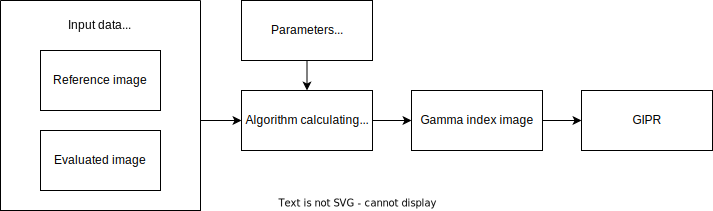
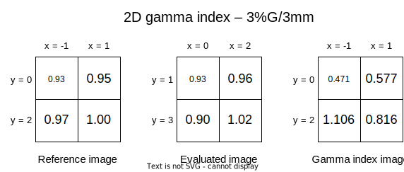

Gamma index
===========

The gamma index was proposed by Low et al. [1]_ in 1998.
It combines two other simpler methods: Dose Difference (DD) and Distance To Agreement (DTA).

Dose Difference
---------------

DD is based on calculating the dose difference at corresponding points :math:`\vec{r_e}` and :math:`\vec{r_r}`
located respectively on the evaluated image :math:`D_e` and the reference image :math:`D_r`.

.. math::
    \delta(\vec{r_r}, \vec{r_e}) = D_e(\vec{r_e}) - D_r(\vec{r_r})

Its acceptance criterion is expressed in percentages [%]. It is related to global or local value:

.. rst-class:: list

- global -- a predetermined value, typically the maximum value in the reference image,
- local -- value at the current point in the reference image.

If DD value at :math:`\vec{r_r}` point is at most the value of acceptance criterion (e.g. 3%, global),
then this point passes the test. Otherwise it fails.

The drawback of this test is that it struggles with high gradient regions, as small shifts in the spatial
distribution of radiation doses can result in large DD values.

Distance To Agreement
---------------------

DTA, on the other hand, is determined by calculating the distance between two closest points with the same dose
on the two images.

.. math::
    r(\vec{r_r}, \vec{r_e}) = | \vec{r_e} - \vec{r_r} |,
.. math::
    where\ \ D_e(\vec{r_e}) = D_r(\vec{r_r})

Its acceptance criterion is expressed in milimeters [mm].
If DTA value at :math:`\vec{r_r}` point is at most the value of acceptance criterion (e.g. 3 mm),
then this point passes the test. Otherwise it fails.

The drawback of this method is that it encounters difficulties in low gradient areas,
where minor dose misalignments may require large search radius (large DTA value).

Gamma function and gamma index
------------------------------

To overcome disadvantages of DD and DTA, the gamma index was developed.
Before calculating it, it is necessary to first determine the gamma function, which combines DD and DTA.

.. math::
    \Gamma(\vec{r_r}, \vec{r_e}) =
    \sqrt{\frac{\delta^2(\vec{r_r}, \vec{r_e})}{\Delta D ^2} + \frac{r^2(\vec{r_r}, \vec{r_e})}{\Delta d ^2}}

:math:`\Delta D` and :math:`\Delta d` are acceptance criteria of DD and DTA, respectively.
The commonly used criteria values are 3%/3mm with global normalization, abbreviated as 3%G/3mm.

Now, to obtain the gamma index value for a single reference point, one must select the minimum value
of the gamma function :math:`\Gamma` for that point and all evaluated points.

.. math::
    \gamma(\vec{r_r}) = \min_{\vec{r_e}}\Gamma(\vec{r_r}, \vec{r_e})

It is calculated for each reference point, and in the end, the image containing gamma index values is obtained.
It has the same size as the reference image.

GIPR
----

The Gamma Index Passing Rate (GIPR) is a measure indicating how many points passed the test --
that is, how many gamma index values are less than or equal to 1.

.. math::
    GIPR = \frac{| \{\gamma(\vec{r_r}) \le 1\} |}{| \{\gamma(\vec{r_r})\} |}

When this value is sufficiently high (e.g. 90%), it can be considered that
the two compared images are sufficiently similar to each other.

Flow diagram
------------

The figure shows the successive stages of the gamma index calculations.
GIPR is an optional step that provides a simple single metric, but analyzing the gamma index image can provide
a lot more information about the result.

Example
-------

To ilustrate how the gamma index works, a simple example is presented here.
It is calculated for two-dimensional images, each containing only 4 elements.

Used parameters are: 3% with global normalization for DD acceptance criterion and 3 mm for DTA acceptance criterion.

Below are the calculations of gamma index image values.
Note that some of the gamma function calculations are skipped, and only minimum values are shown.

.. rst-class:: math-left
.. math::
    \gamma(\vec{r_{r0}}) = \Gamma(\vec{r_{r0}}, \vec{r_{e0}}) =
    \sqrt{\frac{(0.93 - 0.93)^2}{(0.03*1.00)^2} + \frac{(0 - (-1))^2 + (1 - 0)^2}{3^2}} \approx
    \sqrt{0 + 0.222} \approx 0.471

.. rst-class:: math-left
.. math::
    \gamma(\vec{r_{r1}}) = \Gamma(\vec{r_{r1}}, \vec{r_{e1}}) =
    \sqrt{\frac{(0.96 - 0.95)^2}{(0.03*1.00)^2} + \frac{(2 - 1)^2 + (1 - 0)^2}{3^2}} \approx
    \sqrt{0.111 + 0.222} \approx 0.577

.. rst-class:: math-left
.. math::
    \gamma(\vec{r_{r2}}) = \Gamma(\vec{r_{r2}}, \vec{r_{e1}}) =
    \sqrt{\frac{(0.96 - 0.97)^2}{(0.03*1.00)^2} + \frac{(2 - (-1))^2 + (1 - 2)^2}{3^2}} \approx
    \sqrt{0.111 + 1.111} \approx 1.106

.. rst-class:: math-left
.. math::
    \gamma(\vec{r_{r3}}) = \Gamma(\vec{r_{r3}}, \vec{r_{e3}}) =
    \sqrt{\frac{(1.02 - 1.00)^2}{(0.03*1.00)^2} + \frac{(2 - 1)^2 + (3 - 2)^2}{3^2}} \approx
    \sqrt{0.444 + 0.222} \approx 0.816

.. rst-class:: math-left
.. math::
    GIPR = \frac{3}{4} = 75\%

References
----------

.. [1] D. A. Low, W. B. Harms, S. Mutic, and J. A. Purdy,
       “A technique for the quantitative evaluation of dose distributions,”
       Medical Physics, vol. 25, no. 5, pp. 656-661, 1998.
