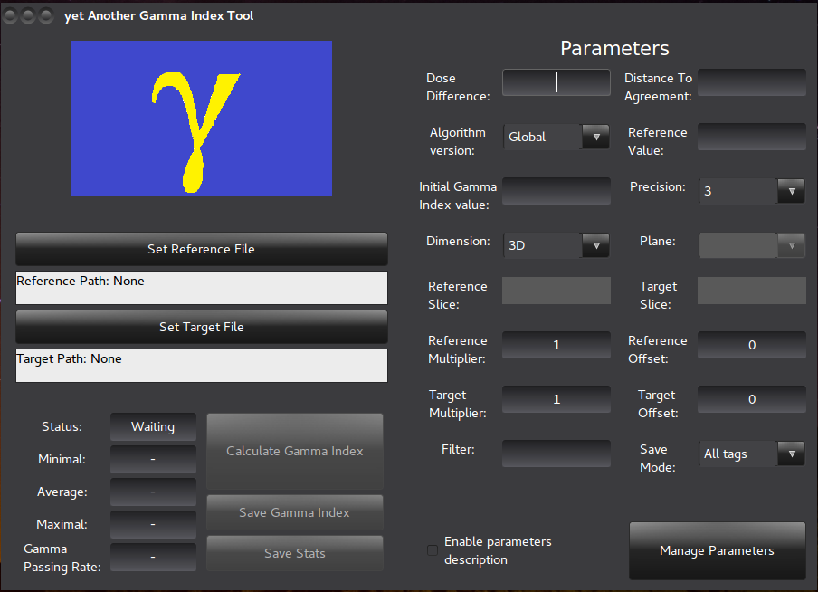
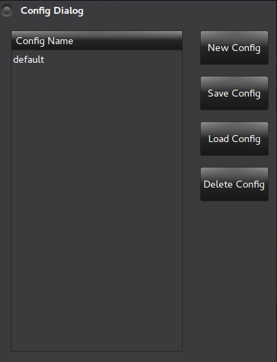

GUI guide
=========

.. note::

   To open the *yAGIT* application properly, you have to run the application executable file from the *gi_gui/* directory. This limitation is connected strongly with location of persistent configuration, icon, logo and is necessary for their proper working. If the application is not started correctly, then the application will not be able to find the above files. All the other functionalities will be working just fine, but user can end up looking for configurations that they were sure, they had saved, but the configurations would not be on the list.

*yAGIT* Application
```````````````````
After starting the program properly user should see the main window of the application:



.. note::
   The application appearance is connected with the operating system and graphic interface and may vary from the screenshot presented above. Example picture was made on Ubuntu 16.04 with GNOME3 graphical interface with BlackMATE theme.

The application was visually divided into to parts:
 - left - responsible for files interaction and calculation of Gamma Index
 - right - responsible for setting and management of parameters


On the left site we can see:
 - The *yAGIT* logo
 - *Set Reference File* button - for choosing file containing reference image
 - *Set Target File* button - for choosing file containing target image
 - Information panel about application status and the statistics of the previous comparison
 - *Save Gamma Index* button - for saving the result Gamma Index matrix into a DICOM file
 - *Save Stats* button - for saving saving statistics of the previous comparison into a text file

Parameters
..........
Comparison parameters can be provided in two ways: by manually setting up parameters or using already saved configurations (from previous comparisons).

If you choose manual way you have to handle following parameters:
 - *Dose Difference* - normalization factor for Dose Difference metric. In percentages. **It is mandatory.**
 - *Distance To Agreement* - normalization factor for Distance To Agreement metric. In millimeters. **It is mandatory.**
 - *Algorithm version* - determines whether a Dose Difference normalization factor should be multiplied by Reference Value (*Global*) or by current value at reference image (*Local*)
 - *Reference Value* - together with Dose Difference parameter creates normalization factor for Dose Difference component in global version of algorithm.
   In case of leaving it blank or setting a non-positive value, a maximum value of reference image will be taken.
 - *Initial Gamma Index Value* - initial value of Gamma Index. The higher it is, the longer the calculations will take. **It is mandatory.**
 - *Precision* - defines how many digits after decimal point will be used during saving image in DICOM file
 - *Dimension* - defines type of comparison:

    + 1D - comparison of two 1D images
    + 2D - comparison of two 2D images
    + 3D - comparison of two 3D images
    + 2.5D - one slice from 3D reference file will be compared with the whole 3D target image
    + 2DFrom3D - comparison of chosen slices from both reference and target 3D images

 - *Plane* - defines the plane (XY, XZ or YZ) for which the slices will be taken. It is required only for 2.5D and 2DFrom3D comparisons.
 - *Reference Slice* - number of the slice in the reference image, which will be compared. It is required only for 2.5D and 2DFrom3D comparisons.
 - *Target Slice* - number of the slice in the target image, which will be compared. It is required only for 2DFrom3D comparison.
 - *Reference Multiplier* - value by which the reference image will be multiplied before comparison. Default is 1.
 - *Reference Offset* - value that will be added to the reference image before comparison. Default is 0.
 - *Target Multiplier* - value by which the target image will be multiplied before comparison. Default is 1.
 - *Target Offset* - value that will be added to the target image before comparison. Default is 0.
 - *Filter* - defines which values in source images will be treated as valid. Below threshold given by a formula *threshold = min + filter% * (max - min)*, points are treated as noise.
 - *Save Mode* - defines which tags from reference image will be rewritten into result image:

    + All tags - all tags will be transferred
    + Any tags - no tags (except from the necessary ones) will be transferred
    + All except Private - only non-private tags will be transferred

Configurations
,,,,,,,,,,,,,,
The alternative way of setting parameters uses configurations. These are the sets of parameters values that can be preserved between the application sessions in the application files. *In order to properly use this feature the application has to be started the way described at the beginning of this guide.* To open the configuration management dialog press *Manage Parameters* button located in right bottom corner of the application.

It should more or less look like this:



We can find here:
 - A list of existing configurations
 - *New Config* button - creates new configuration from the parameters set in the main window.
 - *Save Config* button - updates currently selected configuration with the parameters set in the main window.
 - *Load Config* button - loads currently selected configuration.
 - *Delete Config* - removes currently selected configuration.

Additional features
...................
Tooltips
,,,,,,,,
The *yAGIT* application provides also a feature of tooltips - small explanation messages that pop up when putting the mouse over an element of the interface. Unfortunately, due to some wxWidgets library bug the Windows version of the application has the tooltips turned off. On Linux platform the tooltips can be enabled using the checkbox at the bottom of the window.

Application logs
,,,,,,,,,,,,,,,,
The *yAGIT* application is equipped with logging mechanism. It is turned off by default. In order to turn it on, one can go to *Options* located in menu bar on the top of the application and select *Enable Logging*. The logs will be saved in *log.txt* files located in GUI starting directory. It can be very useful in tracking application flow.

Usage example scenarios
.......................

Gamma Index calculation
,,,,,,,,,,,,,,,,,,,,,,,
1. Open application from *gi_gui/* directory
2. Choose reference image using *Set Reference File* button
3. Choose target image using *Set Target File* button
4. Set parameters manually (including mandatory: Dose Difference, Distance To Agreement, Algorithm Version, Initial Gamma Index Value, Dimension (suitable for selected DICOMs)) or load them from configuration using *Manage Parameters* button
5. Use *Calculate Gamma Index* button to start calculation

Saving result image and statistics into files
,,,,,,,,,,,,,,,,,,,,,,,,,,,,,,,,,,,,,,,,,,,,,
1. Perform at least one comparison
2. Using *Save Gamma Index* button save result of the previous comparison into DICOM file. In case of unavaiability of the button, check the first step for compliance
3. Using *Save Stats* button save statistics of the previous comparison

Saving configuration
,,,,,,,,,,,,,,,,,,,,
1. Set the parameters of the comparison
2. Press *Manage Parameters* button to open configuration dialog
3. To save new configuration use *New Config* button and enter configuration name in next window
4. To overwrite a configuration select one from the list on the left and press *Save Config* button to overwrite it
5. You can now close the configuration dialog

Loading configuration
,,,,,,,,,,,,,,,,,,,,,
1. Press *Manage Parameters* button to open configuration dialog
2. From the list on the left select one configuration
3. Press *Load Config* to load configuration
4. You can now close the configuration dialog
