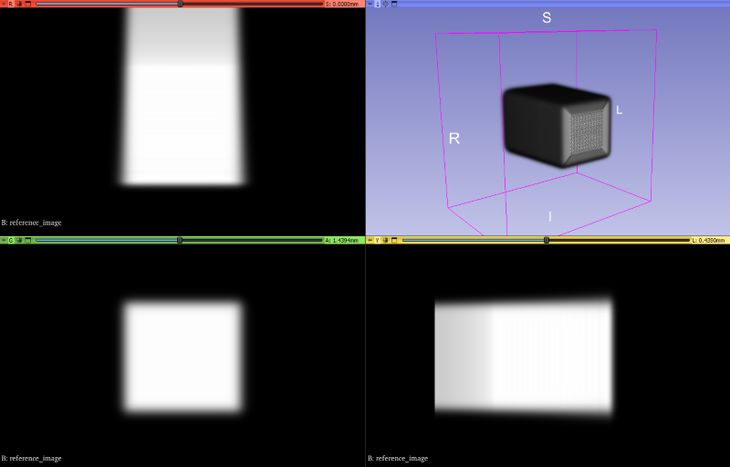
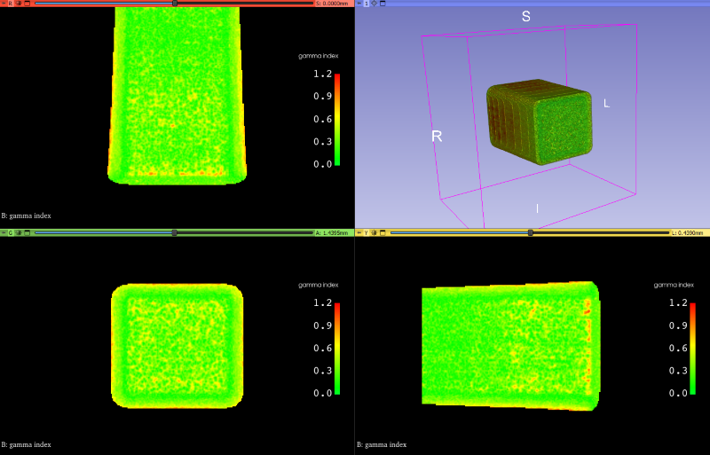

Input and output data
=====================

Algorithms computing the gamma index take two images with radiation dose distributions
and return a single image with gamma index values.

Input data
----------

The input data for the gamma index calculation algorithm consists of two-dimensional or three-dimensional images
containing the distribution of radiation dose.
Two images are needed for comparison: the reference image (also known as measured)
and the evaluated image (also known as calculated or planned).
Typically, the reference image is obtained from measurements of the actual radiation dose by appropriate detectors.
Meanwhile, the evaluated image usually is the image generated by the Treatment Planning System (TPS).

   Simple reference image with spatial distribution of radiation dose visualized in the `3D Slicer`_ program.

.. _3D Slicer: https://www.slicer.org/

Such data are stored in various file formats.
These include, among others, DICOM (.dcm), MetaImage (.mha, .mhd, .raw), and EGSnrc files (.3ddose).

YAGIT is able to read DICOM files with radiation dose data (Modality = RTDOSE) and MetaImage files.

Key elements of input data
~~~~~~~~~~~~~~~~~~~~~~~~~~

The algorithm calculating gamma index requires the following information from the input files:

.. rst-class:: list

- radiation dose values
- size -- number of frames, rows, and columns
- offset/position -- the position of the first voxel in the image, expressed in millimeters.
  Each axis has its own offset value
- spacing -- the spacing between voxels expressed in millimeters. Each axis has its own spacing value

In particular, the reference and evaluated images don't have to have the same sizes, offsets, or spacings.

Output data
-----------

The algorithm outputs an image with gamma index values for each point of the reference image.
The resulting image has the same size, offset, and spacing as the reference image.

   The image with gamma index values calculated for the parameters 3%L/3mm visualized in the `3D Slicer`_ program.
   The black areas contain NaN values.

In YAGIT, the gamma index for reference points that fall below the dose threshold is set to NaN.
The same value is also assigned in the case of local normalization when the algorithm encounters a zero dose value
at a reference point, to avoid division by zero when calculating the gamma function.

Due to the possibility of the resulting image containing NaN values,
a suitable file format for storing the gamma index image is MetaImage.
This is because MetaImage saves image directly in binary format
for both integers and floating-point numbers (including special values such as NaN and infinity).
DICOM, on the other hand, only stores integers as binary data.
If the image contains floating-point numbers, it needs to convert values before saving
and determine appropriate coefficients that will allow for the reconstruction of the original values,
but this prevents the storage of NaN values and infinity.
The only exception is DICOM Parametric Map, which allows for the direct storage of floating-point numbers,
but YAGIT doesn't support it.
