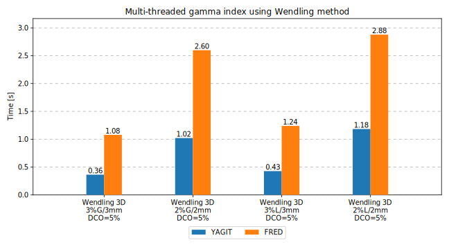

Introduction
============

YAGIT (Yet Another Gamma Index Tool) is an efficient library for calculating the gamma index.
It can be used for the comparison of two images (a reference image and an evaluated image) containing
2D or 3D radiation dose distributions. It is written in C++ and works on Linux and Windows.
The code is free and open-source. It can be found on GitHub: `<https://github.com/DataMedSci/yagit>`_.

Main functionalities
--------------------

Most important features of YAGIT are:

.. rst-class:: list

- two methods of gamma index calculation: classic and Wendling,
- four implementations of the classic method (sequential, multithreaded, SIMD, multithreaded + SIMD),
- two implementations of the Wendling method (sequential, multithreaded),
- three versions of the gamma index: 2D, 2.5D, and 3D,
- reading input files (DICOM and MetaImage),
- saving data and results to an output file (MetaImage),
- linear, bilinear, and trilinear interpolation of data.

Simple example
--------------

Below is a fragment of a program that calculates the 2D gamma index and saves the result to a file.

.. code-block:: c++

    // read a reference image and an evaluated image from DICOM files
    const auto ref2d = yagit::DataReader::readRTDoseDicom("img_ref2d.dcm");
    const auto eval2d = yagit::DataReader::readRTDoseDicom("img_eval2d.dcm");

    // set gamma index parameters
    yagit::GammaParameters params;
    params.ddThreshold = 3.0;  // [%]
    params.dtaThreshold = 3.0;  // [mm]
    params.normalization = yagit::GammaNormalization::Global;
    params.globalNormDose = ref2d.max();
    params.doseCutoff = 0;
    params.maxSearchDistance = 10;  // [mm]
    params.stepSize = params.dtaThreshold / 10;  // [mm]

    // calculate the 2D gamma index using the Wendling method
    const auto gamma = yagit::gammaIndex2D(ref2d, eval2d, params);

    // save the gamma index image to a MetaImage file
    yagit::DataWriter::writeToMetaImage(gamma, "gamma2d.mha");

The image below shows a 2D reference image, a 2D evaluated image, and their comparison.
The gamma index (3%G/3mm) has been calculated using the code above.
In addition, the difference between the evaluated image and the reference image is also shown.

.. figure:: _static/images/introduction_example.jpg
   :alt: Reference image, Evaluated image, Dose difference (eval - ref) image, Gamma index (3%G/3mm) image
   :align: center

More examples with complete code are presented on the :doc:`examples <examples>` subpage.

Performance
-----------

Calculating the 3D gamma index for large images can take a long time,
so an efficient implementation of the algorithm is crucial.
YAGIT is the fastest free library for calculating the gamma index.

   A sample comparison of computation times for YAGIT and `FRED`_.
   The gamma index has been calculated for two 3D images with dimensions of approximately 200x200x200 and GIPR ~ 99%.

.. _FRED: https://www.fred-mc.org/

More information about the performance of YAGIT is presented on the :doc:`performance <performance>` subpage.
