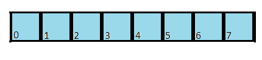
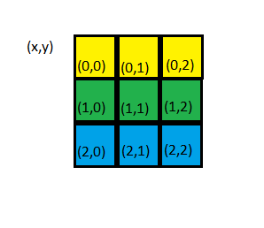
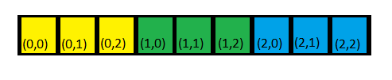
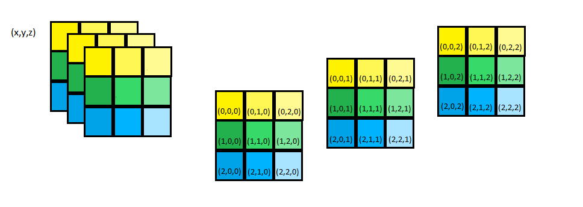
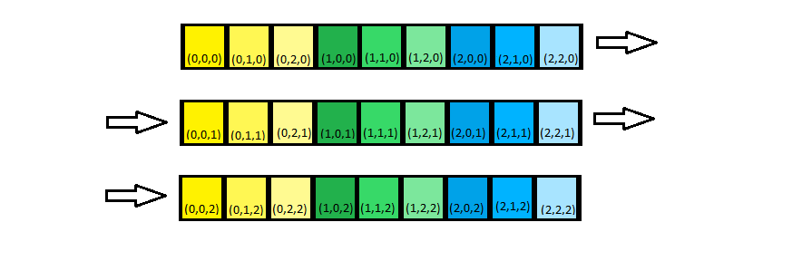

Matrix representation
=====================

Matrix 1D

.. image:: images/matrix_1d.png

Linearized represenation of 1D matrix expected as reference / target parameter in :ref:`calculateGamma() <link-dispatcher>`

Matrix 2D

Linearized represenation of 2D matrix expected as reference / target parameter in :ref:`calculateGamma() <link-dispatcher>`

Matrix 3D

Linearized represenation of 3D matrix expected as reference / target parameter in :ref:`calculateGamma() <link-dispatcher>`

