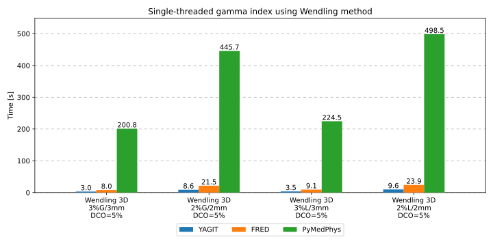
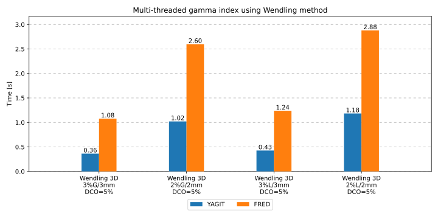

Performance
===========

The performance of YAGIT has been compared with the performance of `FRED`_ and `PyMedPhys`_.
The gamma index module of FRED has been tested using the `FRED tools`_ library,
which calls functions of that module internally.

.. _FRED: https://www.fred-mc.org/
.. _FRED tools: https://github.com/jasqs/FREDtools
.. _PyMedPhys: https://github.com/pymedphys/pymedphys

Performance tests have been executed on a machine with an AMD Ryzen 7 5800H processor,
which has a clock speed of 3.2 GHz and features 8 cores and 16 threads. The machine has 16 GB of RAM DDR4 3200 MHz.

It has been tested on Windows 11 Home 64-bit (version 22H2) operating system with WSL2 and Ubuntu 22.04.2 LTS.
FRED's gamma index module requires Linux, so all tools have been tested on WSL2 to maintain an identical environment.

This system contains gcc and g++ compilers in version 11.4.0 with glibc 2.35 and libstdc++ 3.4.30, CMake 3.22.1,
and Python 3.10.12.

Tested versions of tools are:

.. rst-class:: list

- YAGIT built from 51d34ae commit (05.09.2023) using CMake tool in Release mode and g++ compiler,
- FRED tools 0.6.79 with libFredGI.so 4.2,
- PyMedPhys 0.39.3.

Two 3D DICOM images have been used in the tests.
They have been generated using irradiation plans from DCPT LET-measurements 2022 [1]_.
The reference image has been created in Eclipse TPS using an analytical dose calculation algorithm for proton therapy,
and the evaluated image has been created in TOPAS using Monte Carlo (MC) simulation.
The reference image has dimensions of 198x198x198, while the evaluated image has dimensions of 200x200x200.
The GIPR is quite high (~ 99%), which affects the computation time in the case of the tested Wendling method --
in general, the higher the GIPR, the faster the gamma index is calculated.

Performance comparison
----------------------

.. rst-class:: center-headers right-align-vals
.. table::
    :align: center

    +------------+----------------------------------------------------------------+
    |            | Average time [s]                                               |
    |            +-------------------------+-------------------------+------------+
    | DD/DTA     | YAGIT                   | FRED                    | PyMedPhys  |
    |            +------------+------------+------------+------------+------------+
    |            | 1 thread   | 16 threads | 1 thread   | 16 threads | 1 thread   |
    +============+============+============+============+============+============+
    | Wendling method -- 3D                                                       |
    +------------+------------+------------+------------+------------+------------+
    | 3\%G/3mm   | 3.022      | 0.363      | 7.991      | 1.078      | 200.822    |
    +------------+------------+------------+------------+------------+------------+
    | 2\%G/2mm   | 8.637      | 1.021      | 21.472     | 2.598      | 445.684    |
    +------------+------------+------------+------------+------------+------------+
    | 3\%L/3mm   | 3.534      | 0.427      | 9.145      | 1.238      | 224.542    |
    +------------+------------+------------+------------+------------+------------+
    | 2\%L/2mm   | 9.618      | 1.183      | 23.895     | 2.878      | 498.518    |
    +------------+------------+------------+------------+------------+------------+

The table shows the comparison of calculation times between YAGIT, FRED, and PyMedPhys.
Other parameters: normalization dose = max value in the reference image,
dose cutoff = 5% of max value in the reference image, search radius = 3*DTA, step size = DTA/10.

When using 16 threads, YAGIT and FRED speed up about 8 times.
It is 8, not 16, because the CPU on which it has been run has 8 cores.
16 threads have been used to achieve better speedup due to simultaneous multithreading (SMT).
PyMedPhys has been tested only with one thread because it doesn't support multithreaded gamma index.

The first image shows differences in computation times between single-threaded YAGIT, FRED, and PyMedPhys.
YAGIT is about 2.5 times faster than FRED and about 50--70 times faster than PyMedPhys.

The second image shows differences in computation times between multi-threaded YAGIT and FRED.
YAGIT is about 2--3 times faster than FRED.

GIPR comparison
----------------------

.. rst-class:: center-headers right-align-vals
.. table::
    :align: center

    +------------+--------------------------------------+
    |            | GIPR [%]                             |
    | DD/DTA     +------------+------------+------------+
    |            | YAGIT      | FRED       | PyMedPhys  |
    +============+============+============+============+
    | Wendling method -- 3D                             |
    +------------+------------+------------+------------+
    | 3\%G/3mm   | 99.960     | 99.960     | 99.967     |
    +------------+------------+------------+------------+
    | 2\%G/2mm   | 99.144     | 99.145     | 99.232     |
    +------------+------------+------------+------------+
    | 3\%L/3mm   | 99.959     | 99.959     | 99.966     |
    +------------+------------+------------+------------+
    | 2\%L/2mm   | 99.049     | 99.050     | 99.025     |
    +------------+------------+------------+------------+

In this table, it can be noticed that the values of GIPR in YAGIT and FRED are nearly identical.
However, PyMedPhys returns values that slightly differ from the other two tools.

References
----------

.. [1] N. Bassler, L. Grzanka, J. B. Christensen, J. Villads, H. Brkić, Y. Perrot, L. Pasariček, and M. Romero-Expósito,
       “MC particle transport simulations for the 2022 LET-measurements at DCPT: v1.0.0”.
       Zenodo, February 09, 2024. doi: 10.5281/zenodo.10641085.
